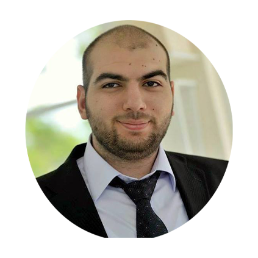

# 
 CHRISTAPHOR HARMANDARIAN 
### 
 Beirut - Dekwaneh - Str Slav
### 
 Email: [christapor.harmandarian](mailto:christapor.harmandarian@gmail.com) &ensp; Tel: [+96170890342](tel:+96170890342)
---

## 
 **Profesional Experience**
- **Network Engineer - Unique Tel IP - January2018-2020**
  - Properly instaled Mikrotik & Cisco router based on customer needs
  - Set up GNS3 Network Automation and layout maps of client’s network, monitor and manage
    all client’s devices on a daily basis
  - 802.1Q VLAN tunneling, inter VLAN routing for VOIP, CCTV, multiple SSID and 
   other routing context
  - Configuringhotspotandcreatinguserswithcustom limitationssuchasqueuetraffic,
scheduling,blockingURLsusingProxyserve
  - Set up IP Sec VPNs, Terminal Servers, FTP and NAS servers
  - Developed Firewall, NAT modules, proxies for Residential Gateway product
   
   
  
 

- **IT Support - ZAKHEM - June 2016-November 2017**
  - First line investigation of hardware and software defects
  - Assisting users with routine backups and software upgrades
  - Responsible for routing departmental tasks, maintain work and inventory records.
  - Surveying Active Directory, DFS Namespace/Replication and Microsoft Exchange Services.
  - Investigated various security incidents, applying solutions such as implenting HoneyPots
  - Upgrade and configure network equipment (access points, repeaters, switches and routers) 
    for use on operational networks.
  - Provide troubleshooting and configuration support for client desktop and networking 
    environment.
 
 

- **IT/Technician - FreeLance - 2011-Present**
  - Coordinated with a team to resolve Networking issues.
  - Coordinated with a team to set up labor force.
  - Supervised labor team bringing projects to completion on time and withing budget.
  - Interacted with vendors for buying the right equipements to fit the client's needs.
  - Layout Networking Strategies.
 
 

## 
 **Education**
- **Bachelor of Engineering**

Computer and Comunication Engineer- Notre Dame University  - December 2017

- **Lebanese Baccalaureate in General Sciences**

Collège des Frères Mont la Salle - Ain Saadeh - June 2011
 
 

## 
 **Proficiencies**
- **SKILLS**
  - Strong TCP/IP networking skills. including in depth knowledge of DNS, SMTP, HTTP, HTTPS 
     and SSH protocols
  - Knowledge of MS Word, Excel, PowerPoint, pspice, Photoshop, Sony Vegas, Adobe Audition 
  - Programming Experience: C++, C#, C,JavaScript
  - Public Speaking-President of my High School. Gained confidence and learned to engage 
     audiences with my speeches

- **Languages**
  - English, Arabic, French, Armenian: Fluent 
  - Italian, Japanese: Beginner 

